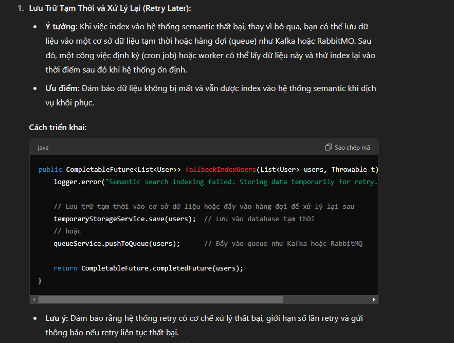

# Giả lập luồng import file csv, lưu vào DB, index vào elasticsearch của TLA

## Luồng cơ bản:
1. Import csv
2. Lưu vào DB
3. Index elasticsearch

### Chi tiết luồng 3 : index elasticsearch, Cơ chế handle fallback khi service elasticsearch lỗi:

 - 
 - 